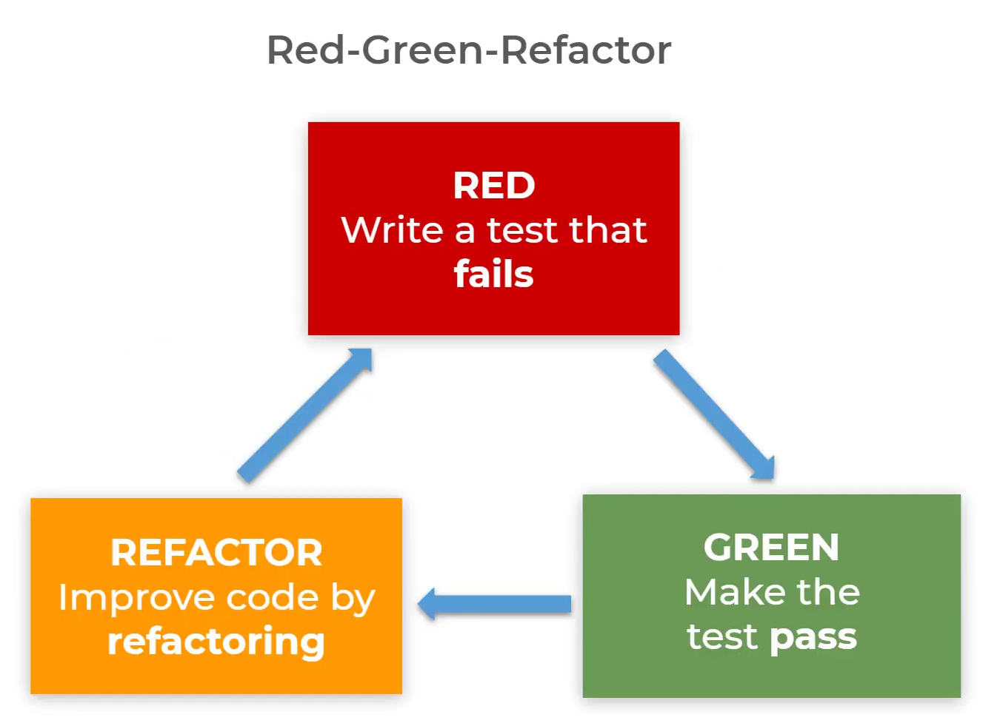

# Python Testing Our Student Class

## Introduction

This project was done as part of the Diploma in Full Stack development course provided by the Code Institute. It demonstrates unit testing in Python using a simple `Student` class. It includes implementation of the class and a corresponding test suite to ensure the functionality of the class methods.

- It follows the Red, Green, Refactor method in Test-Driven Development
When we write our tests first, they are bound to fail as we haven’t written code to be tested yet.

- This is the ‘red’ part of the cycle. The idea  is that we write our code in a way that gets the tests to pass. This is the green part of  our cycle.

- Once the code passes a test, we can refactor the test and the code to be more efficient,  which is the refactor part of the cycle.

## Project Structure

The project consists of the following files:
- `student.py`: Contains the implementation of the `Student` class.
- `test_student.py`: Contains the unit tests for the `Student` class.

## Student Class

The `Student` class represents a student and includes the following attributes and methods:

### Attributes
- `first_name`: The first name of the student.
- `last_name`: The last name of the student.
- `start_date`: The date when the student started, set to the current date.
- `end_date`: The date when the student's course ends, set to one year from the start date.
- `naughty_list`: A boolean indicating whether the student is on the naughty list.

### Methods
- `full_name`: Returns the full name of the student.
- `email`: Returns the email address of the student.
- `alert_santa`: Adds the student to the naughty list.
- `apply_extension(days)`: Extends the end date by the specified number of days.
- `course_schedule()`: Fetches the course schedule for the student.

## Unit Tests

The `TestStudent` class contains unit tests for the `Student` class. The tests include:

- `test_full_name`: Verifies that the `full_name` property returns the correct full name.
- `test_email`: Verifies that the `email` property returns the correct email address.
- `test_alert_santa`: Verifies that the `alert_santa` method adds the student to the naughty list.
- `test_apply_extension`: Verifies that the `apply_extension` method correctly extends the end date.
- `test_course_schedule_success`: Mocks a successful response from the `course_schedule` method and verifies the returned schedule.
- `test_course_schedule_failed`: Mocks a failed response from the `course_schedule` method and verifies the returned error message.

## Mocking

This project uses mocking in the following way:
- A method is created to make a request to a fictional external API to retrieve a student’s course schedule.
- Tests are written to mock this request to ensure the method behaves as expected both when the request is successful and when it fails.

Before creating the method to retrieve a student’s course schedule, it is necessary to import the `requests` module in the `student.py` file to use it for making requests to the fictional API service.

